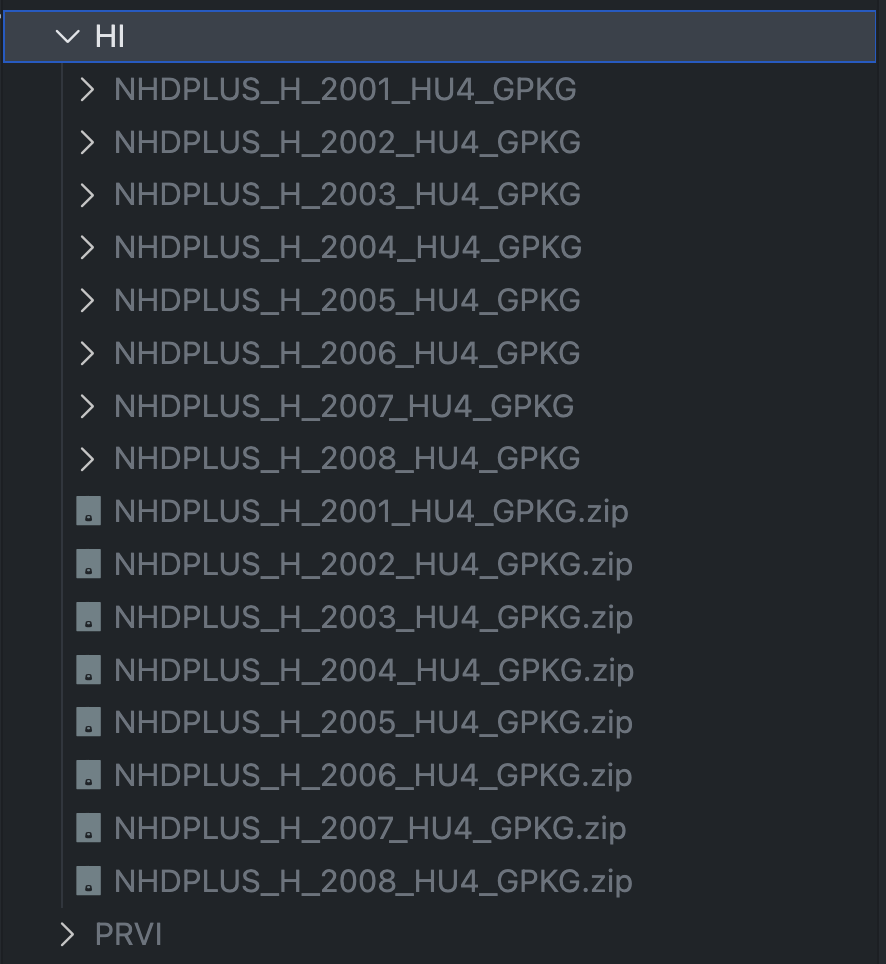

# Reference-Builds

This repo is meant to take OCONUS reference data products and convert them into reference-files that can be used in the [NGWPC/nhf-builds](https://github.com/NGWPC/nhf-builds/) Repository

## Data sources:
### Science Base
The NHDPlusHR is used for *PRVI* and *HI* and can be downloaded in HUC4 form through:
https://www.sciencebase.gov/catalog/item/57645ff2e4b07657d19ba8e8

the zipped geopackage is required

### GeoGlows
GeoGlows v2 is used for the *AK* reference and can be downloaded from the following location:
- http://geoglows-v2.s3-website-us-west-2.amazonaws.com/#hydrography/vpu=801/
- http://geoglows-v2.s3-website-us-west-2.amazonaws.com/#hydrography/vpu=802/
- http://geoglows-v2.s3-website-us-west-2.amazonaws.com/#hydrography/vpu=803/
- http://geoglows-v2.s3-website-us-west-2.amazonaws.com/#hydrography/vpu=705/

the `catchment.parquet` and `streams_mapping.gpkg` files are required from each VPU

### saved location

This data only needs to be unzipped in it's "domain" folder for it to be picked up by the example scripts



## Quick Start

All dependencies can be installed through
```
uv sync
```

and the example configs can be used to create the references once the data is downloaded

```
uv run python builds/build_reference.py --config config/example_prvi.yaml
uv run python builds/build_reference.py --config config/example_hi.yaml
uv run python builds/build_reference.py --config config/example_ak.yaml
```
